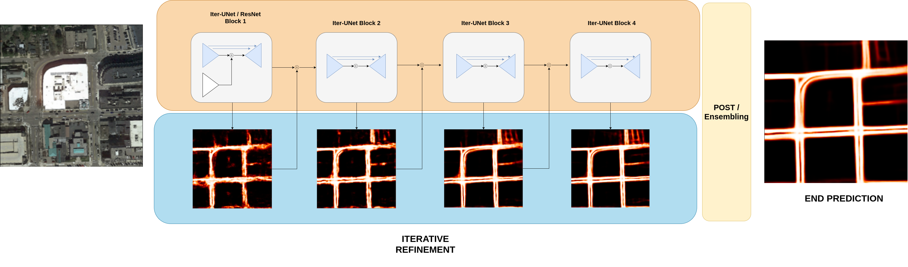

# Iter-UNET: Iterative Road Segmentation from Aerial Images




This repository contains the code & report for the CIL21 road segmentation project.

Our team name on kaggle is `PixelSurfers`, an our team consists of:

 - Nicolas Dutly
 - Janik Lobsiger
 - Fabijan Dokic

The focus of our project is the investigation of if and how stacking & combining UNet models can lead to performance benefits.

We call our architecture IterUNet. This code repository is structured as follows:

 - `baseline`: Contains the code needed to reproduce the FCN-ResNet and deeplab baseline results
 - `stacking_eval`: Contains the code needed to reproduce our model evaluation experiments as well as our final submission

 The files in each directory are somewhat similar / redundant but we grouped them into different directories for clarity.

### Evaluation

To evaluate the impact of different variants of our model and compare them to the benchmarks, we always do 2-fold cross validation and report the following metrics:

 - Intersection over Union (IoU)
 - Pixel Accuracy

We chose not to include the kaggle score for comparative experiments as the limited public test-set does not allow for significant comparisons to be made.

Of course, for the final submission (which includes test time augmentation and ensembling), we do report the (public) kaggle score.

### Installation


All commands provided in this file assume that you run the code on the cluster. Start by loading the required modules:

 - `module load gcc/6.3.0 python_gpu/3.7.1 cuda/10.1.243 cudnn/7.6.4 eth_proxy`

For convenience we included a `requirements.txt` file which can be used to install the same package we used as follows:

- Create a python environment: `python -m venv env`
- Activate the created environment: `source env/bin/activate`
- Update pip3: `pip install --upgrade pip`
- Install the requirements: `pip3 install -r requirements.txt`

### Reproduce Submission
The final submission can be repoduced with the following commands, run from the `stacking_eval` directory.

1. Download the extended dataset from
https://polybox.ethz.ch/index.php/s/KsWqVBk2ppukgSa

2. Train the 5 ensemble models

In `train_ensemble.py`, adjust the paths on lines 16, 17 to where you extracted the extended dataset and the path on 21 to where the trained model should be saved. Then train with the following commands:
```
bsub -W 24:00 -o resunet_hg_4_seed42 -n 2 -R "rusage[ngpus_excl_p=1,mem=8096]" -R "select[gpu_model0==GeForceRTX2080Ti]" python train_ensemble.py --ckpt_dir resunet_hg_4_seed42 --nb_blocks 4 --unet_mode classic-backbone --stacking_mode hourglass --loss_mode sum --max_epochs 50 --res 320 --batch_size 5 --seed 42
bsub -W 24:00 -o resunet_hg_4_seed2 -n 2 -R "rusage[ngpus_excl_p=1,mem=8096]" -R "select[gpu_model0==GeForceRTX2080Ti]" python train_ensemble.py --ckpt_dir resunet_hg_4_seed2 --nb_blocks 4 --unet_mode classic-backbone --stacking_mode hourglass --loss_mode sum --max_epochs 50 --res 320 --batch_size 5 --seed 2
bsub -W 24:00 -o resunet_hg_4_seed111 -n 2 -R "rusage[ngpus_excl_p=1,mem=8096]" -R "select[gpu_model0==GeForceRTX2080Ti]" python train_ensemble.py --ckpt_dir resunet_hg_4_seed111 --nb_blocks 4 --unet_mode classic-backbone --stacking_mode hourglass --loss_mode sum --max_epochs 50 --res 320 --batch_size 5 --seed 111
bsub -W 24:00 -o resunet_hg_4_seed163 -n 2 -R "rusage[ngpus_excl_p=1,mem=8096]" -R "select[gpu_model0==GeForceRTX2080Ti]" python train_ensemble.py --ckpt_dir resunet_hg_4_seed163 --nb_blocks 4 --unet_mode classic-backbone --stacking_mode hourglass --loss_mode sum --max_epochs 50 --res 320 --batch_size 5 --seed 163
bsub -W 24:00 -o resunet_hg_4_seed1234 -n 2 -R "rusage[ngpus_excl_p=1,mem=8096]" -R "select[gpu_model0==GeForceRTX2080Ti]" python train_ensemble.py --ckpt_dir resunet_hg_4_seed1234 --nb_blocks 4 --unet_mode classic-backbone --stacking_mode hourglass --loss_mode sum --max_epochs 50 --res 320 --batch_size 5 --seed 1234
```
Note: if you want to reproduce predictions without retraining, you can download the trained weights from here:
- Model trained on extended data & used for final submission (91.5%): 
https://polybox.ethz.ch/index.php/s/bnmoR3L2EjeKCbQ
- Model trained on CIL data only (91%):
https://polybox.ethz.ch/index.php/s/yBcXT3lnBwUeTwN

4. Make predictions
```
predict_ensemble.py
mask_to_submission.py
```
(Adjust the path on line 27 in `predict_ensemble.py` to where your model was saved)


### Reproduce Baselines

The FCN-ResNet & Deeplabv3 baselines can be reproduced with the following commands, run from the `baselines` directory.

```
bsub -W 240 -oo fcn_101_gpu.txt -R "rusage[ngpus_excl_p=1, scratch=10000,mem=10000]" -R "select[gpu_model0==GeForceRTX2080Ti]" python ./training.py fcn_resnet101 eval

bsub -W 240 -oo deeplab_101_gpu.txt -R "rusage[ngpus_excl_p=1, scratch=10000,mem=10000]" -R "select[gpu_model0==GeForceRTX2080Ti]" python ./training.py deeplabv3_resnet101 eval

```

The standart UNet baseline can be reproduced by navigating to the `stacking_eval` directory and running:

```
bsub -W 4:00 -o unet_1 -R "rusage[ngpus_excl_p=1,mem=8096]" -R "select[gpu_model0==GeForceRTX2080Ti]" python train.py --nb_blocks 1 --unet_mode classic --stacking_mode hourglass --loss_mode sum --max_epochs 300 --res 128
```

## Reproduce IterUNet Experiments

Our model evaluation experiments can be repoduced with the following commands, run from the `stacking_eval` directory.


#### hourglass stacking

```
bsub -W 4:00 -o unet_hg_2 -R "rusage[ngpus_excl_p=1,mem=8096]" -R "select[gpu_model0==GeForceRTX2080Ti]" python train.py --nb_blocks 2 --unet_mode classic --stacking_mode hourglass --loss_mode sum --max_epochs 300 --res 128
bsub -W 4:00 -o unet_hg_4 -R "rusage[ngpus_excl_p=1,mem=8096]" -R "select[gpu_model0==GeForceRTX2080Ti]" python train.py --nb_blocks 4 --unet_mode classic --stacking_mode hourglass --loss_mode sum --max_epochs 300 --res 128
```

#### simple stacking
```
bsub -W 4:00 -o unet_simple_2 -R "rusage[ngpus_excl_p=1,mem=8096]" -R "select[gpu_model0==GeForceRTX2080Ti]" python train.py --nb_blocks 2 --unet_mode classic --stacking_mode simple --loss_mode sum --max_epochs 300 --res 128
bsub -W 4:00 -o unet_simple_4 -R "rusage[ngpus_excl_p=1,mem=8096]" -R "select[gpu_model0==GeForceRTX2080Ti]" python train.py --nb_blocks 4 --unet_mode classic --stacking_mode simple --loss_mode sum --max_epochs 300 --res 128
```

### UNet-ResNet


#### hourglass stacking
```
bsub -W 4:00 -o resunet_hg_2 -R "rusage[ngpus_excl_p=1,mem=8096]" -R "select[gpu_model0==GeForceRTX2080Ti]" python train.py --nb_blocks 2 --unet_mode classic-backbone --stacking_mode hourglass --loss_mode sum --max_epochs 300 --res 128
bsub -W 4:00 -o resunet_hg_4 -R "rusage[ngpus_excl_p=1,mem=8096]" -R "select[gpu_model0==GeForceRTX2080Ti]" python train.py --nb_blocks 4 --unet_mode classic-backbone --stacking_mode hourglass --loss_mode sum --max_epochs 300 --res 128
```

####  hourglass stacking, no aux. losses
```
bsub -W 4:00 -o resunet_hg_4-last -R "rusage[ngpus_excl_p=1,mem=8096]" -R "select[gpu_model0==GeForceRTX2080Ti]" python train.py --nb_blocks 4 --unet_mode classic-backbone --stacking_mode hourglass --loss_mode last --max_epochs 300 --res 128
```

#### simple stacking
```
bsub -W 4:00 -o resunet_simple_2 -R "rusage[ngpus_excl_p=1,mem=8096]" -R "select[gpu_model0==GeForceRTX2080Ti]" python train.py --nb_blocks 2 --unet_mode classic-backbone --stacking_mode simple --loss_mode sum --max_epochs 300 --res 128
bsub -W 4:00 -o resunet_simple_4 -R "rusage[ngpus_excl_p=1,mem=8096]" -R "select[gpu_model0==GeForceRTX2080Ti]" python train.py --nb_blocks 4 --unet_mode classic-backbone --stacking_mode simple --loss_mode sum --max_epochs 300 --res 128
```


